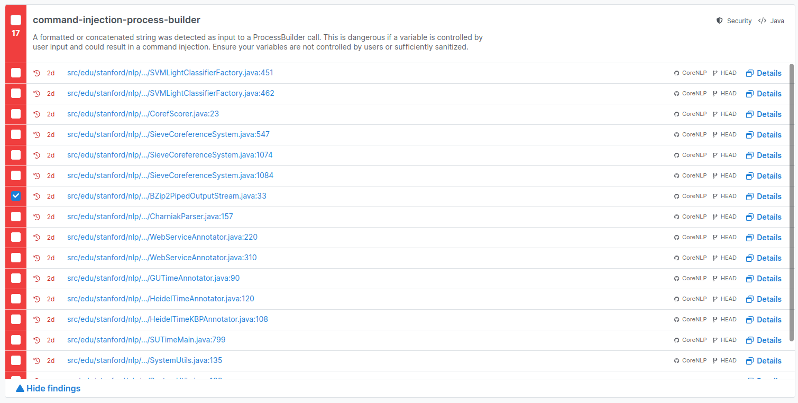
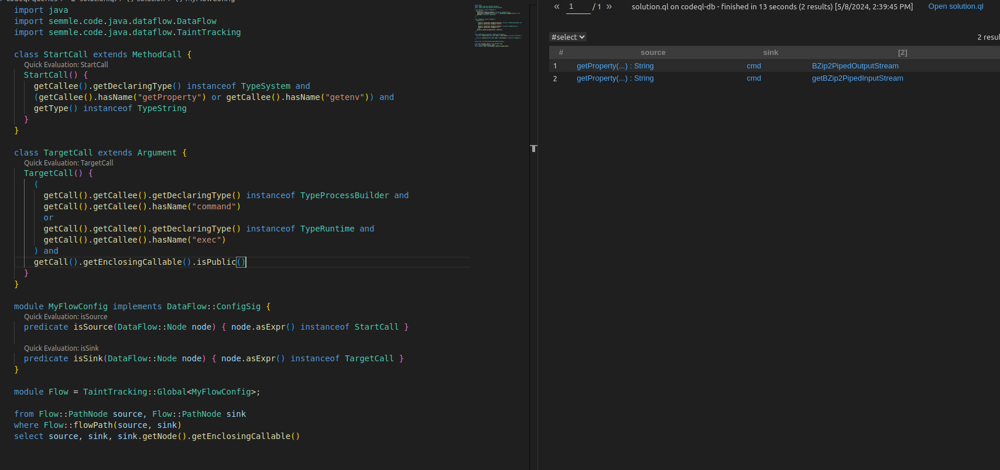

# HW 1. CVE-2023-39020

```bash
git clone https://github.com/stanfordnlp/CoreNLP.git
git checkout v3.9.2
codeql database create --source-root ./CoreNLP/src -j 0 -l java ./codeql-db
```

Примеры использования уязвимости в `./demo/`

```java
public static InputStream getBZip2PipedInputStream(String filename) throws IOException {
    String bzcat = System.getProperty("bzcat", "bzcat");
    Runtime rt = Runtime.getRuntime();
    String cmd = bzcat + " " + filename;
    //log.info("getBZip2PipedInputStream: Running command: "+cmd);
    Process p = rt.exec(cmd);
    Writer errWriter = new BufferedWriter(new OutputStreamWriter(System.err));
    StreamGobbler errGobbler = new StreamGobbler(p.getErrorStream(), errWriter);
    errGobbler.start();
    return p.getInputStream();
}
```

Понятно, что можно подменить property `bzcat` на произвольную команду и запустить её.

После запуска `semgrep ci` эта уязвимость не найдена, однако найдена подобная ей (помечена галочкой): 



```java
public BZip2PipedOutputStream(String filename) throws IOException {
    this(filename, System.err);
}

public BZip2PipedOutputStream(String filename, OutputStream err) throws IOException {
    String bzip2 = System.getProperty("bzip2", "bzip2");
    String cmd = bzip2; // + " > " + filename;
    //log.info("getBZip2PipedOutputStream: Running command: "+cmd);
    ProcessBuilder pb = new ProcessBuilder();
    pb.command(cmd);
    this.process = pb.start();
    this.filename = filename;
    OutputStream outStream = new FileOutputStream(filename);
    errWriter = new PrintWriter(new BufferedWriter(new OutputStreamWriter(err)));
    outGobbler = new ByteStreamGobbler("Output stream gobbler: " + cmd + " " + filename,
            process.getInputStream(), outStream);
    errGobbler = new StreamGobbler(process.getErrorStream(), errWriter);
    outGobbler.start();
    errGobbler.start();
}
```

Снова можно подменить property, чтобы запустить произвольную команду (пример так же есть в `./demo/`)

# CodeQL

Будем искать пути в коде от `getProperty` (так же будем искать вызовы `System.getenv`) до вызовов `exec()` или `command()` соответствующих классов (код в `/codeql-queries/solution.ql`)



Найдем вызовы этих функций (код в `/codeql-queries/callsDangerous.ql`)

